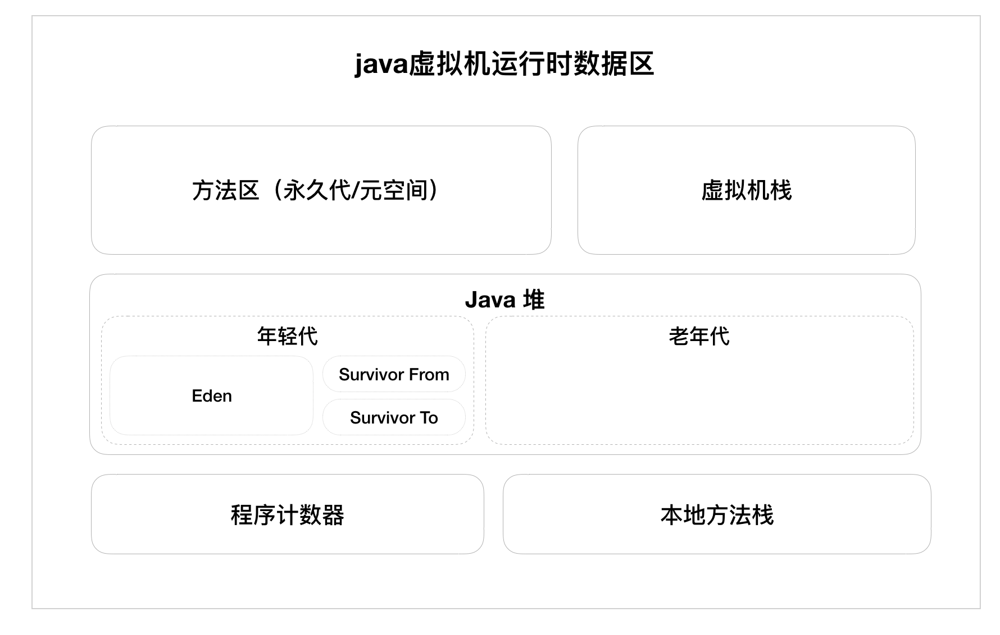

## JVM 学习总结

### 一、内存动态分配

***java与c++之间有一堵由内存动态分配和垃圾回收技术所围成的“高墙”，墙外的人想进去，墙里面的人却想出去。***

#### java虚拟机运行时的数据区

* 程序计数器

  它是一块较小的内存空间，可以把它看作是当前线程所执行的字节码行号指示器，线程私有。

* 虚拟机栈

  每个方法在执行的同时，都会创建一个栈帧，用于存放局部变量表，操作数表，方法出口等信息，每个方法从调用直到执行完成的过程，就对应着一个栈帧在虚拟机栈中的入栈和出栈的过程，线程私有。

* 本地方法栈

  类似于虚拟机栈，本地方法是这样的一个方法：该方法的实现由非java语言实现。 

* java堆

  java堆是虚拟机所管理的内存中最大的一块，是所有线程共享的。它的唯一目的就是存放对象实例。java堆是垃圾收集器管理的主要区域。（新生代和老年代）

* 方法区

  线程共享，它用于存储已经被虚拟机加载的类信息、常量、静态变量等。