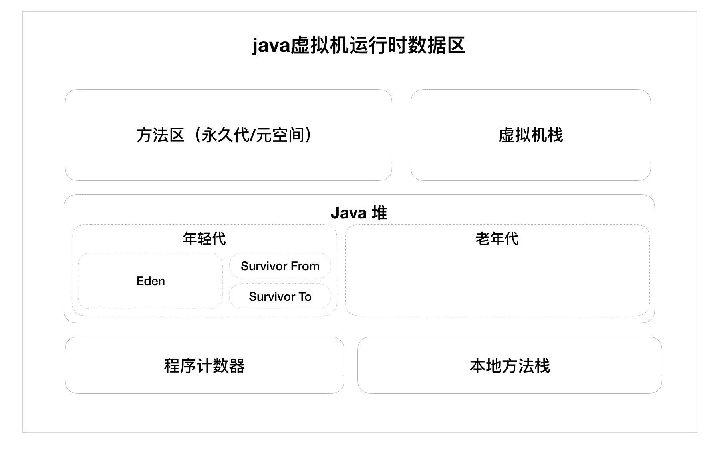

## 垃圾回收与内存动态分配

***java与c++之间有一堵由内存动态分配和垃圾回收技术所围成的“高墙”，墙外的人想进去，墙里面的人却想出去。***

#### 1.1  java虚拟机运行时的数据区

* 程序计数器

  它是一块较小的内存空间，可以把它看作是当前线程所执行的字节码行号指示器，线程私有。

* 虚拟机栈

  每个方法在执行的同时，都会创建一个栈帧，用于存放局部变量表，操作数表，方法出口等信息，每个方法从调用直到执行完成的过程，就对应着一个栈帧在虚拟机栈中的入栈和出栈的过程，线程私有。

* 本地方法栈

  类似于虚拟机栈，本地方法是这样的一个方法：该方法的实现由非java语言实现。 

* java堆

  java堆是虚拟机所管理的内存中最大的一块，是所有线程共享的。它的唯一目的就是存放对象实例。java堆是垃圾收集器管理的主要区域。（新生代和老年代）

* 方法区

  线程共享，它用于存储已经被虚拟机加载的类信息、常量、静态变量等。它被称为永久代，自JDK1.8之后，永久代被移除，取而代之的是“元空间”。元空间和永久代之间的差别在于：元空间并不在虚拟机中，而是在本地内存中，因此，在默认情况下，元空间的大小仅受本地内存限制。

#### 1.2  垃圾回收

##### 1.2.1  对象是否已死？

在堆里面存放着java世界中几乎所有的对象实例，垃圾回收器在对堆进行回收之前，第一件事情就是要确定这些对象之中哪些还存活着，哪些已经死去。判断对象是否存活的算法主要有以下两种：

* 引用计数算法

  给对象中添加一个引用计数器，每当有一个地方引用它时，计数器就加1；当引用失效时，计数器就减1；当计数器为0时，表示它没有被任何地方引用，可以被回收了。算法实现简单，效率也很高，但无法解决对象之间相互引用而造成的内存泄漏。

* 可达性分析算法

  该算法的基本思想是：通过一系列的称为“GC Roots”的对象作为起点，从这些节点开始向下搜索，搜索所走过的路径称为引用链（Reference Chain），当一个对象到GC Roots没有任何引用链相连时，则证明此对象是不可用的。在Java语言中，可作为GC Roots的对象包括：虚拟机栈中引用的对象；方法区中类静态属性引用的对象；方法区中常量引用的对象；本地方法栈中引用的对象。

***引用***

- 强引用(Strong Referene)就是指在程序代码之中普遍存在的，只要强引用在存在，垃圾收集器就永远不会回收掉被引用的对象。
- 软引用(Soft Referene)是用来描述一些有用但并非必须的对象。对于软引用关联着的对象，在系统将要发生内存溢出异常之前，将会把这些对象列进回收范围之中进行第二次回收，如果这次回收还没有足够的内存，才会抛出内存溢出的异常。
- 弱引用(Weak Reference)也是用来描述非必要的对象的，但是它的强度比软引用更弱一点，被弱引用关联的对象只能生存到下一次垃圾收集发生之前。当垃圾收集器工作时，无论内存是否足够，都会回收掉只被弱引用关联的对象。
- 虚引用(Phantom Reference)也称为幽灵引用或幻影引用，它是最弱的一种引用。一个对象是否有虚引用的存在，完全不会对其生存时间构成影响，也无法通过虚引用来取得一个对象实例。为一个对象设置虚引用的唯一目的就是能在这个对象被垃圾收集器回收时收到一个系统通知。

##### 1.2.2  最后的自我拯救

即使在可达性分析算法中不可达的对象，也并非是非死不可，这个时候它们暂处于缓刑阶段。finalize()方法是对象逃脱死亡命运的最后一次机会，只需要重写该方法，并在方法中重新将此对象与其他引用链上的对象建立关联关系即可。要真正宣告一个对象死亡，至少要经历两次标记过程：如果对象不可达，那它将会被第一次标记并进行一次筛选，筛选的条件是此对象是否有必要执行finalize()方法，当对象没有重写finalize()方法或者虚拟机已经调用了它的finalize()方法，则被视为没有必要执行。如果这个对象被判定有必要执行finalize()方法，那么这个对象将被放进一个叫做F-Queue的队列之中，稍后GC将对F-Queue中的对象进行第二次标记，如果此时对象通过finalize()方法拯救了自己，那在第二次标记时此对象将被移除即将回收的集合，否则，它将被作为垃圾进行回收。

##### 1.2.3  垃圾回收算法

* 标记-清除算法（Mark-Sweep）

  算法分为标记和清除两个阶段，首先标记出所有需要回收的对象，在标记完成后统一回收所有被标记的对象。它有两个不足之处：一是标记和清除两个过程的效率都不高；二是容易产生大量不连续的内存碎片，空间碎片太多可能会导致以后在程序运行过程中需要分配较大对象时，无法找到足够的连续内存空间而不得不提前触发一次垃圾回收动作。

* 复制算法

  它将内存按容量划分为大小相等的两块，每次只使用其中的一块。当这一块内存使用完了，就将还存活着的对象复制到另外一块上面，然后再把已使用过的内存空间一次清理掉。缺点：一是内存被缩小到了原来的一半，二时是在对象存活率较高时就要进行较多的复制操作，效率将会变低。

  现在的商业虚拟机都采用复制算法来回收年轻代，根据IBM公司的专门研究表明，年轻代中的对象98%是“朝生夕死”，所以并不需要按照1:1的比例来划分内存空间，而是将内存分为一块较大的Eden空间和两块较小的Survivor空间，每次使用Eden和其中一块Survivor。但回收时，将Eden和Survivor中还存活的对象一次性复制到另外一块Survivor中，最后清理掉Eden和刚才用过的Survivor空间。HotSpot虚拟机默认Eden和Survivor的大小比例时8:1，也就是每次新生代中可用内存空间为整个新生代容量的90%，只有10%的内存会被浪费掉。

* 标记-整理算法

  标记过程仍然与“标记-清理”算法一样，但后续步骤不是直接对可回收的对象进行清理，而是让所有存活的对象都向一端移动，然后直接清理掉端边界以外的内存。

* 分代收集算法

  根据对象存活周期的不同将内存划分为几块，一般是把Java堆分为年轻代和老年代，这样就可以根据各个年代的特点采用最适当的收集算法。在年轻代中，每次垃圾收集时都会发现有大批对象死去，只有少量存活，那就选用复制算法，只需要付出少量存活对象的复制成本就可以完成收集。而老年代中因为对象的存活率高，没有额外空间对它进行分配担保，就必须使用标记-清理或者标记-整理算法来进行回收。

  

##### 1.2.4  Minor GC 、 Major GC  与 Full GC

* Minor GC（年轻代 GC）:指发生在年轻代的垃圾回收动作，因为Java对象大多都具备朝生夕死的特性，所以Minor GC非常频繁，一般回收速度也比较快。
* Major GC（老年代GC）:指发生在老年代的GC，出现了Major GC，经常会伴随至少一次的Minor GC。Major GC的速度一般会比Minor GC慢10倍以上。
* Full GC: 清理整个堆空间，回收年轻代和老年代。通常Major GC和Full GC是等价的。

#### 1.3  内存分配策略

- 对象优先在Eden区分配

  大多数情况下，对象在年轻代Eden区分配。当Eden区没有足够空间进行分配时，虚拟机将发起一次Minor GC。

- 大对象直接进入老年代

  所谓大对象，是指需要大量连续内存空间的Java对象。经常出现大对象容易导致内存还有不少空间时就提前触发垃圾收集以获取足够的连续空间来安置它们。虚拟机提供一个-XX：pretenureSizeThreshold参数，令大于这个值的对象直接在老年代分配，这样的目的是避免在Eden区和两个Survivor区之间发生大量的内存复制。

- 长期存活的对象将进入老年代

  既然虚拟机采用了分代收集的思想来管理内存，那么内存回收时就必须能识别出哪些对象应该放在年轻代，哪些对象应该放在老年代中。为了做到这一点，虚拟机给每个对象定义了一个对象年龄（Age）计数器。如果对象在Eden区出生，并经过一个Minor GC后仍然存活，而且能够被Survivor容纳的话，该对象将被移动到Survivor空间中，且对象的年龄设置为1。对象在Survivor区中每熬过一次Minor GC，年龄就增加1岁，当年龄增加到一定程度（默认为15岁），就会被晋升到老年代中。对象晋升老年代的年龄阈值，可以通过参数-XX:MaxTenuringThreshold设置。

- 动态对象年龄判定

  虚拟机并不是永远要求对象的年龄必须大于MaxTenuringThreshold才能够晋升为老年代，如果在Survivor空间中相同年龄所有对象大小的总和大于Survivor空间的一半，年龄大于或者等于该年龄的对象就可以直接进入老年代中。

- 空间分配担保

  在发生Minor GC之前，虚拟机会先检查老年代最大可用的连续空间是否大于新生代所有对象总空间，如果这个条件成立，那么Minor GC可以确保是安全的。如果不成立，则虚拟机会查看HandlePromotionFailure设置值是否允许担保失败，如果允许，那么会继续检查老年代最大可用连续空间是否大于历次晋升到老年代对象的平均大小，如果大于，将尝试着进行一次Minor GC，如果小于，或者HandlePromotionFailur设置为不允许冒险，那这时要改为进行一次Full GC.

***注：本篇文章中的内容是根据《深入理解Java虚拟机--JVM高级特性与最佳实践》而总结的***