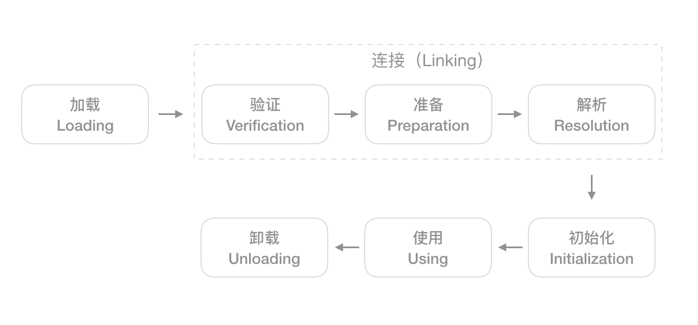

## 虚拟机类加载机制

虚拟机把描述类的数据从Class文件加载到内存，并对数据进行校验、转换解析和初始化，最终形成可以被虚拟机之间使用的Java类型，这就是虚拟机的类加载机制。

#### 类的生命周期



类从被加载到虚拟机内存中开始，到卸载出内存为止，它的整个生命周期包括：加载、验证、准备、解析、初始化、使用、卸载7个阶段，其中验证、准备、解析3个部分被称为接连。


#### 什么时候需要对类进行初始化

什么情况下需要对类进行加载，Java虚拟机规范中并没有进行强制约束，但虚拟机规范中却严格规定类有且只有5中情况必须立即对类进行初始化（而加载、验证等自然而然需要在此之前开始）。

* 遇到new、getstatic、putstatic、invokestatic这四条字节码指令时，如果类没有进行过初始化，则需要先出发其初始化。这四条指令最常见的场景是：使用new关键字实例化对象的时候、读取或者设置一个类的静态字段的时候、以及调用一个类的静态方法的时候。
* 使用java.lang.reflect包的方法对类进行反射调用的时候，如果类没有进行过初始化，则需要先触发其初始化。
* 当初始化一个类的时候，如果发现其父类还没有进行过初始化，则需要先触发其父类的初始化。
* 当虚拟机启动时，用户需要指定一个要执行的主类（包含main()方法的那个类），虚拟机会先初始化这个主类。
* 当使用JDK1.7的动态语言支持时，如果一个java.lang.invoke.MethodHandle实例最后的解析结果是REF_getStatic、REF_putStatic、REF_invokeStatic的方法句柄并且这个方法句柄所对应的类还没有进行初始化，则需要先触发其初始化。


#### 加载阶段

在类的加载阶段，虚拟机需要完成以下3件事情：

* 通过一个类的全限定名来获取定义此类的二进制字节流。
* 将这个字节流所代表的静态存储结构转化为方法区的运行时数据结构。
* 在内存中生成一个代表这个类的java.lang.Class对象，作为方法区这个类的各种数据的访问接口。


#### 验证阶段

验证是连接阶段的第一步，这一阶段的目的是为了确保Class文件的字节流中包含的信息符合当前虚拟机的要求，并且不会危害虚拟机自身的安全。验证阶段大致上会完成下面4个阶段的检查动作：

* 文件格式验证

  主要是语法校验，例如是否以魔数0xCAFEBASE开头、常量池中是否有不被支持的常量类型等。

* 元数据验证

  对类的元数据进行语义校验，保证不存在不符合Java语言规范的元数据信息。例如这个类是否有父类、这个父类是否继承了不允许被继承的类、如果这个类不是抽象类，是否实现了其父类或者接口之中要求实现的所有方法等。

* 字节码验证 

  通过数据流和控制流分析，确定程序语义是否合法。例如保证指令不会跳转到方法体以外的字节码指令上、保证方法体中的类型转换是有效的等。

* 符号引用验证

  确保解析动作能够正常执行。例如引用中通过字符串描述的全限定名是否能够找到对应的类、符号引用中的类、字段、方法的访问性（private、protected、public、default）是否可被当前类访问等。


#### 准备阶段

准备阶段是正式为类变量分配内存并设置类变量初始值的阶段，这些变量所使用的内存都将在方法区中进行分配。有两点需要注意：首先，这个时候进行内存分配的仅包含类变量（被static修饰的变量），而不包含实例变量，实例变量将会在对象实例化时随着对象一起分配在Java堆上中；其次，这里所说的初始值通常情况下时数据类型的零值。例如

```java
public static int value = 1;
```

那变量value在准备阶段过后的初始值为0，而不是1。在初始化阶段，才会把1赋值给value。


#### 解析阶段

解析阶段是虚拟机将常量池内的符号引用替换为直接引用的过程。符号引用以一组符号来描述所引用的目标，它和虚拟机的内存布局无关；直接引用可以是直接指向目标的指针、相对偏移量或者一个能间接定位到目标的句柄。直接引用是和虚拟机实现的内存布局有关。


#### 初始化阶段

初始化阶段是类加载过程的最后一步。在准备阶段，类变量已经赋过一次系统要求的初始值，而在初始化阶段，则根据程序员通过程序定制的主观计划去初始化类变量和其他资源，或者可以从另外一个角度表达：初始化阶段是执行类构造器\<clinit>()方法的过程。

* \<clinit>()方法是由编译器自动收集类中的所有变量的赋值动作和静态语句块中的语句合并产生的，编译器收集的顺序是由语句在源文件中出现的顺序所决定的，静态语句块中只能访问到定义在静态语句块之前的类变量，定义在它之后的类变量，在静态语句块中可以赋值，但不可以访问。
* \<clinit>()方法与实例构造器\<init>()方法不同，它不需要显示的调用父类构造器，虚拟机会保证在子类的\<clinit>()方法执行之前，父类的\<clinit>()方法已经执行完毕，因此在虚拟机中，第一个被执行的\<clinit>()方法肯定是java.lang.Object。
* 由于父类的\<clinit>()方法先执行，也就意味着父类中定义的静态语句块要优先于子类的类变量赋值操作。
* \<clinit>()方法对于类或者接口来说并不是必需的，如果一个类中没有静态语句块，也没有对类变量的赋值操作，那么编译器就不会为这个类生成\<clinit>()方法。
* 接口中不能有静态语句块，但可以有类变量的赋值操作，因此接口和类都会生出\<clinit>()方法，但执行接口中的\<clinit>()方法不需要先执行父类的\<clinit>()方法，只有当子接口使用类父接口的 变量时，父接口才会初始化，另外，接口的实现类也不需要在初始化的时候执行接口的\<clinit>()方法。
* 虚拟机会保证一个类的\<clinit>()方法在多线程环境中被正确的加锁、同步，如果多个线程同时去初始化一个类，那么只有一个线程去执行这个类的\<clinit>()方法，其他线程阻塞等待。


#### 类加载器

类加载器除了用于实现类的加载动作外，还起到了命名空间的作用。对于任何一个类来说，都需要有加载它的类加载器和这个类本身一同确立其在Java虚拟机中的唯一性，每一个类加载器，都拥有一个独立的类名称空间。

##### 类加载器的双亲委派模型


* 启动类加载器：它使用C++语言实现，主要负责将存放在<JAVA_HOME>\lib目录下的类库加载到虚拟机内存中。

* 扩展类加载器：它使用Java语言实现，主要负责加载<JAVA_HOME>\lib\ext目录下的类库。

* 应用程序类加载器：它使用Java语言实现，它负责加载用户类路径\<ClassPath>上所指定的类库。如果应用程序中没有自定义类加载器，一般情况下，这个就是程序中默认的类加载器。

* 自定义类加载器：开发者自定义的类加载器。

  

双亲委派模型要求除了顶层的启动类加载器之外，其余的类加载器都应当有父类加载器。这里的父子关系不是以继承来实现的，而是用组合的方式来实现。双亲委派模型的工作过程为：如果一个类加载器收到了类加载的请求，它首先不会自己尝试加载该类，而是把这个请求委派给父类加载器去完成，每个层次的类加载器都是如此，因此所有的加载请求最终都会被传送到启动类加载器中，只有当父类加载器反馈自己无法完成这个加载请求时，子加载器才会尝试自己去加载。


使用双亲委派模型的好处就是Java类随着它的加载器一起具备类一种带有优先级的层次关系。例如类java.lang.object，它存放在rt.jar中，无论哪个类加载器要加载这个类，最终都委派给最顶层的启动类加载器进行加载，因此Object类在程序的各种类加载器环境中都是同一个类。相反，如果没有双亲委派模型，由各个类加载器自行去加载的话，如果用户自己编写了一个java.lang.Object的类，并放在程序的ClassPath中，那系统中将会出现多个不同的Object类，Java类型体系中最基础的行为也就无法保证。应用程序也将变得一片混乱。